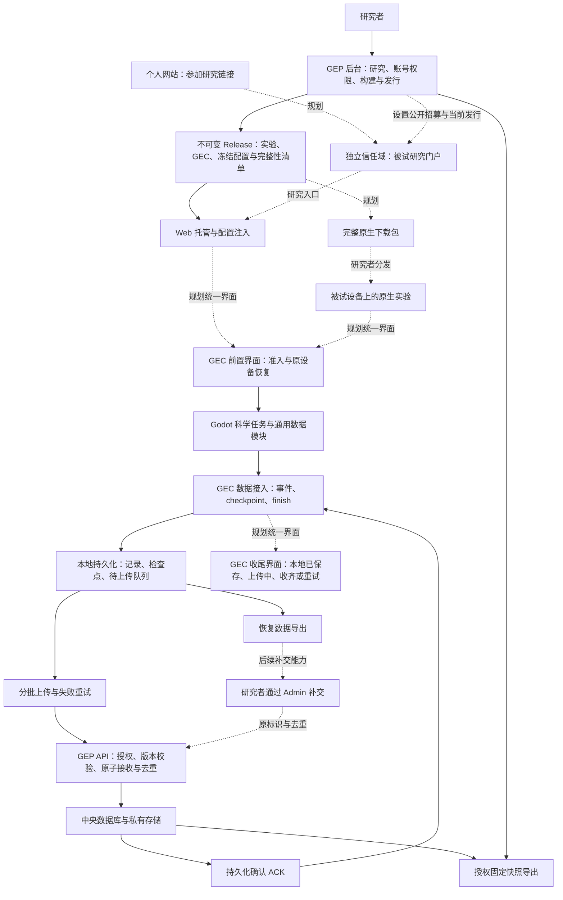

# GEP — GuguguLab Experiment Platform

GEP 提供研究者后台与数据服务，GEC 为实验提供本地优先的数据接入。当前已有可运行的**隔离合成工程版**，尚未完成 Phase 01–03 全部验收，不能用于真实研究收数。

同一个 Godot 合成任务通过自己的通用数据模块运行；本地后端、Web IndexedDB 后端和原生 SQLite 后端由入口选择。任务包含 RT／选择和不规则嵌套事件。后台提供三种准入、构建登记、Web 包上传／预览／批准、原生连接配置、状态、受控恢复、受保护固定快照与成员权限。

已实测 Godot 4.7.2、macOS 26.6.2 arm64、Chrome 152：Web 和独立原生程序的数据经本地事务、真实 HTTP API、数据库、ACK 和 JSONL 导出对账；覆盖断网、丢 ACK、进程终止、完整 trial 恢复及清理边界。实际支持范围和未执行项见[验收记录](public_docs/verification.md)。

## 启动

```sh
uv sync --frozen --python 3.12
pnpm install --frozen-lockfile
.venv/bin/python tools/dev_instance.py
.venv/bin/python tools/serve.py
```

打开 `http://admin.localhost:8000/login`。首次初始化生成本地随机合成凭据，再次启动不重建账号。[完整构建、配置、演示和验收步骤](public_docs/quickstart.md)。

## 当前边界

- Web 已在 Mac 与实体 Windows Chrome 验证；独立原生仅实测 macOS arm64，其他原生平台不承诺兼容。
- 完成任务、本地保存、服务器收齐和科学验收是不同事实。
- 只支持原设备／原存储的明确 trial 恢复；公开 ID 不能取回旧答案或接管会话。
- 最小 Compose 已在隔离 Linux arm64 环境通过真实上传、重启/替换持久化、Owner 与错卷验收。Windows 11 / Chrome 的实体 LAN 基础链路已验；Mac 原生窗口与实际按键已验，独立研究者操作仍待验。
- Runner、Future GEP Launcher（可选 LAN 分发工具）、自动分析、真实研究和生产部署未启用；独立研究者验收和真实研究门槛仍未完成，详见验收记录。

## 开发状态与下一步验收

更新于 **2026-09-12**。Phase 01、02 的有限合成工程验收完成；Phase 03 原版本工程回归通过，但预演暴露的可用性与产品结构差距仍在修复。**Phase 03 尚未完成，独立 T17 尚未通过。**

| 阶段 | 范围 | 当前状态 |
|---|---|---|
| Phase 01 | 数据链路、事务、去重、授权导出、最小 Compose 持久化 | 有限工程验收完成 |
| Phase 02 | Web/macOS 插件、三种准入、断网补传、检查点恢复、共享设备与清理边界 | 有限工程验收完成；实体 Windows LAN 已补验 |
| Phase 03A | 下载、设置回显、名单反馈、错误提示与权限控件 | 首批基础修复已实现并通过定向工程验证 |
| Phase 03B | Owner/Admin/普通用户、账号生命周期、实例权限矩阵、Excel 预览导入 | 下一开发批次，尚未实现完整模型 |
| Phase 03C | 研究公开设置、唯一当前招募发行、旧会话兼容 | 待开发 |
| Phase 03D | GEC 统一参与壳、短恢复码、完整冻结原生包 | 待开发 |
| Phase 03E | 模块化后台、主题与中英文、被试研究门户 | 待开发 |
| Phase 03F | 集成回归、原设计者自主体验、非开发者独立 T17 | 待前述范围完成；不能用自动化替代人类验收 |
| Phase 04 | 具体研究、正式部署、独立备份恢复、隐私治理与科学时序 | 未启动 |

**最近完成的基础修复：**

- metadata 作为 `.metadata.json` 附件下载；下载时继续检查权限，固定快照保持不变。
- 参与方式和招募状态正确回显；招募选择后立即提交，暂停/关闭仍保留有效旧会话上传。
- 名单支持标准 CSV、前导零及带引号的密码，错误整批回滚，成功显示新增数量；旧 Tab 提交保持兼容。
- 发行显示平台与版本，只有已批准且有托管资源的 Web 发行显示网页入口；预览与入口使用配置的实验服务地址和端口。
- 后台提供中文权限说明和表单错误反馈；无权控件隐藏，服务端仍拒绝越权请求，其他成员不能撤销 Owner 的研究权限。

最近批次 **44 项定向服务端测试、1 项真实 Chrome 浏览器测试通过**，包括实际 metadata 下载、招募状态持久化及就地错误显示。此前原版本服务端 **56 项**、发行准备 **2 项**及贯通 **31 项**通过；两批证据覆盖不同范围，不能相加当作一次完整回归。环境、复现命令及限制见[验收记录](public_docs/verification.md)。

验收顺序：完成反馈开发与工程回归 → 原设计者无逐步指导地自行跑通并确认体验可交付 → 未参与开发的人执行[独立 T17](public_docs/researcher_acceptance.md)。原设计者受指导预演、自主体验及自动 GUI 测试都不能替代独立 T17。

## 使用指南

- [研究者](public_docs/researcher.md)：参与设置、名单、发行、招募与导出。
- [实验开发者](public_docs/experiment_developer.md)：通用数据模块、GEC 接入及版本边界。
- [维护者](public_docs/maintainer.md)：合成环境、服务地址与定向验证。
- [完整启动与构建](public_docs/quickstart.md) · [GEP/1 协议](public_docs/protocol.md) · [第三方声明](public_docs/third_party.md)。

## 许可

GEP 与 GEC 的项目原创代码采用 [Apache License 2.0](LICENSE)。允许使用、修改、分发与商业使用，具体义务以许可证正文为准。

第三方依赖及材料保留各自的许可证，见[第三方声明](public_docs/third_party.md)。研究者上传的实验、量表、刺激材料及被试数据不因使用本软件而自动适用本许可证。

## 目标架构

目标是让研究者专注实验本体：通过少量适配代码接入 GEC，在 GEP 配置研究后，选择 Web 托管或下载完整实验包交给被试。**以下为目标设计，尚未全部交付。**实验文件分发与数据收集分开，GEC 不接管刺激、Trial、随机化或科学逻辑。



实线表示主要数据或资源流向，虚线标识规划中的连接；验收范围以上方进度表为准。

### GEC 统一参与流程

GEC 提供前置准入／恢复和后置收尾界面；实验结束调用 `finish()` 后，由 GEC 展示本地保存、上传和服务器确认状态。参与方式由冻结配置动态决定，同一实验构建支持无需 ID、名单 ID、ID+密码。

Web 自动注入配置；普通原生流程优先提供包含实验资源、GEC、冻结公开配置与完整性清单的完整包。单独替换 `connection.json` 保留为开发／兼容路径。**当前已有原生程序与配置导出，后台完整包下载尚未交付。**

恢复入口计划使用六位短码，结合短有效期、限次、限速、一次性消费和原设备私密证明；短码本身不能接管旧会话。旧 release、session、待上传队列和有效恢复路径保持原绑定，不能被新配置静默重定向。

### 账号与后台

目标账号层级为 Owner → Admin → 普通用户。Owner 管理实例与 Admin；Admin 管理非 Owner 账号，不能修改 Owner 或授予 Owner-only 权限。账号支持邀请自行设密及临时密码首次登录强制修改。

独立“用户与权限”页面按用户列出每项研究的可见性及细分权限；不可见研究的子权限必须关闭，服务端拒绝矛盾状态。权限变更及 Excel 批量导入先校验预览，再由操作者密码重新认证后原子提交、审计差异；不导出现有密码或哈希。

后台采用卡片 Dashboard、稳定导航及研究模块页，视觉参考 Gugugu Lab 的温暖浅色、细边框和低饱和深绿，支持系统／浅色／深色主题与中英文。数据页面优先保证表格、搜索、筛选、状态和无障碍可读性。**这些结构调整尚未整体实现。**

### 被试门户与发行

个人网站未来提供参加研究链接，跳转至独立信任域的实验门户。被试选择研究，不选择 release UUID 或技术版本。每项研究默认只有一个当前招募发行；切换只影响新 session，已开始、恢复和待上传会话继续绑定原发行。

门户只展示明确设为公开且正在招募的研究；名单制、邀请制或私有研究不因开放准入自动公开。已结束研究默认隐藏，可选择展示无开始按钮的公开摘要。并行 A/B 需要研究者明确且可审计的分配规则。**门户及公网部署尚未启用。**

### 后续分发与补交

- 完整包可通过机构现有设施、网盘、U 盘或 LAN 共享分发；发布产物不可变，修改必须创建新 Release。
- GEC 已能导出恢复数据；研究者通过 Admin 补交并按原标识去重仍是后续目标。导出不删除未确认队列，也不代表服务器已经收齐。
- Future GEP Launcher 是可选 LAN 分发工具，仅提前下载、校验、缓存与分发。它不是本地 GEP 或必需客户端，待现有分发设施暴露明确痛点后再评估，不开发通用 Runner。
- 教师机本地数据缓冲及延迟同步属于更后期扩展；当前不承诺完全离线首次准入或程序关闭后持续后台上传。

完整包已纳入 Phase 03D；Launcher、教师机数据缓冲及 Admin 恢复包补交不属于本轮 Phase 03A–F 必需交付。正式部署、独立备份恢复和具体研究验收保留在 Phase 04。
