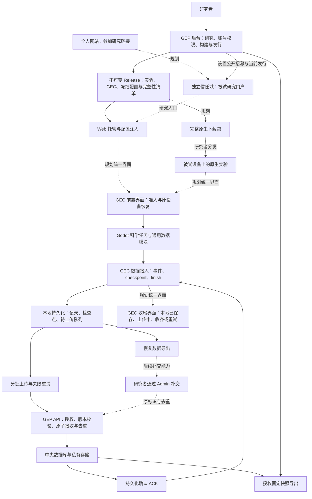

# GEP — GuguguLab Experiment Platform

GEP 提供研究者后台与数据服务，GEC 为实验提供本地优先的数据接入。当前已有可运行的**隔离合成工程版**，尚未完成 Phase 01–03 全部验收，不能用于真实研究收数。

同一个 Godot 合成任务通过自己的通用数据模块运行；本地后端、Web IndexedDB 后端和原生 SQLite 后端由入口选择。任务包含 RT／选择和不规则嵌套事件。后台提供三种准入、构建登记、Web 包上传／预览／批准、原生连接配置、状态、受控恢复、受保护固定快照与成员权限。

已实测 Godot 4.7.2、macOS 26.6.2 arm64、Windows 11 Pro 26200 x64、Chrome 152：Web 和独立原生程序的数据经本地事务、真实 HTTP API、数据库、ACK 和 JSONL 导出对账；覆盖断网、丢 ACK、进程终止、完整 trial 恢复及清理边界。实际支持范围和未执行项见[验收记录](docs/verification.md)。

## 启动

```sh
uv sync --frozen --python 3.12
pnpm install --frozen-lockfile
.venv/bin/python tools/dev_instance.py
.venv/bin/python tools/serve.py
```

打开 `http://admin.localhost:8000/login`。首次初始化生成本地随机合成凭据，再次启动不重建账号。[完整构建、配置、演示和验收步骤](docs/quickstart.md)。

## 当前边界

- Web 已在 Mac 与实体 Windows Chrome 验证；独立原生在 macOS arm64 与 **Windows x64（Windows 11 Pro 26200，AMD64）** 都有真实运行证据：Windows 上三种冻结模式（共用同一不可变 Windows 构建）的准入、断网本地提交与重连补传、丢 ACK 去重、进程终止重开、检查点恢复与短码、重放/过期拒绝、共享写锁、清理与仅数据恢复、无秘密失败导出，以及本地 SQLite／服务器数据库／授权 JSONL 逐事件 ID 逐值对账全部通过（一次完整实机运行 236 项检查 0 失败，严格门槛 `--windows-run/--windows-prep` 为 `RUNTIME_PASS`）；其他原生平台不承诺兼容（Windows 与 macOS 不是同一个二进制）。Windows 包未做代码签名，SmartScreen 提示状态未知。**实机工程证据不等于人的结论：2026-09-21 已进行非开发者人工测试并形成修复反馈；修复后的完整回归与新一轮人工测试尚未进行。**
- 完成任务、本地保存、服务器收齐和科学验收是不同事实。
- 只支持原设备／原存储的明确 trial 恢复；公开 ID 不能取回旧答案或接管会话。
- 最小 Compose 已在隔离 Linux arm64 环境通过真实上传、重启/替换持久化、Owner 与错卷验收。Windows 11 / Chrome 的实体 LAN 基础链路已验；Mac 原生窗口与实际按键已验，独立研究者操作仍待验。
- Runner、Future GEP Launcher（可选 LAN 分发工具）、自动分析、真实研究和生产部署未启用；独立研究者验收和真实研究门槛仍未完成，详见验收记录。

## 开发状态与下一步验收

更新于 **2026-09-23**。Phase 01、02 的有限合成工程验收完成；Phase 03 预演暴露差距的工程修复、受影响集成回归与 Windows x64 实机工程运行已完成。**Phase 03 尚未完成：2026-09-21 已进行非开发者人工测试并形成修复反馈；修复与完整工程回归仍在进行，尚未进行新一轮人工测试。**

本轮账号权限修复已通过定向工程回归（含真实 Chrome）：研究列表与单对象授权统一，显式隐藏不会被默认权限重新覆盖，研究创建授权与写入在同一事务内完成，未知权限版本拒绝处理。新合成实例使用 v2；旧实例保留 v1，需先在合成副本演练，再由 Owner 预览差异并确认切换。详见[维护者说明](docs/maintainer.md)；这些检查不代表 Phase 03 人工验收完成。

| 阶段 | 范围 | 当前状态 |
|---|---|---|
| Phase 01 | 数据链路、事务、去重、授权导出、最小 Compose 持久化 | 有限工程验收完成 |
| Phase 02 | Web/macOS 插件、三种准入、断网补传、检查点恢复、共享设备与清理边界 | 有限工程验收完成；实体 Windows LAN 已补验 |
| Phase 03A | 下载、设置回显、名单反馈、错误提示与权限控件 | 首批基础修复已实现并通过定向工程验证 |
| Phase 03B | Owner/Admin/普通用户、账号生命周期、实例权限矩阵、Excel 预览导入 | 已实现并通过定向工程验证（T26 工程证据）；2026-09-21 人工测试已发生并形成修复反馈，修复后的完整回归与新人工测试尚未进行 |
| Phase 03C | 研究公开设置、唯一当前招募发行、旧会话兼容 | 已实现并通过定向工程验证（含只读迁移演练） |
| Phase 03D | GEC 统一参与壳、短恢复码、macOS arm64／Windows x64 完整冻结原生包 | macOS 完整包与 Web 壳已实现并有合成工程闭环；Windows x64 平台契约、交叉构建与**真实实机执行**均有工程证据（WN01–WN06 一次完整运行 236 项 0 失败）；2026-09-21 人工测试已发生并形成修复反馈；修复后的完整回归与新人工测试尚未进行 |
| Phase 03E | 模块化后台、主题与中英文、被试研究门户 | 已实现并通过定向工程验证 |
| Phase 03F | 集成回归、Windows 原生实机验收与人工测试 | 工程编排、隔离回归与 **Windows x64 实机 WN01–WN06 工程门槛**已完成（严格门槛 `RUNTIME_PASS`）；2026-09-21 人工测试已发生并形成修复反馈，修复后的完整回归与新人工测试尚未进行 |
| Phase 04 | 具体研究、正式部署、独立备份恢复、隐私治理与科学时序 | 未启动 |

**2026-09-23 本轮修复（工程侧进行中，待新一轮人工测试）：**

- 构建与发行页上传失败时在原地显示具体原因（ZIP 无效、程序摘要不一致、描述字段/schema 不合法、原生包缺少入口或依赖等，中英文一致），失败不产生新构建或发行，旧发行不变。
- 批准合成发行后定位到同一研究“构建与发行”页的对应发行条目。
- 账号邀请只显示一条由受控管理主机名与服务器实际端口组成的完整设密链接（显式配置的管理来源优先；不采用请求头中的端口，也不读取转发的来源），并说明它与临时密码登录的区别；邀请页明确一次性有效。
- 公开文档统一为“人工测试”口径：2026-09-21 人工测试已发生并形成反馈，取消“原设计者先行自主体验 → 独立 T17”的强制顺序，T17 保留编号，帮助/失败/未运行分别如实记录。
- 其余反馈修复（权限内核与迁移、账号生命周期、研究删除、名单/导出、GEC 收尾等）仍在进行，未完成前不宣称已交付。

**最近完成的基础修复：**

- metadata 作为 `.metadata.json` 附件下载；下载时继续检查权限，固定快照保持不变。
- 参与方式和招募状态正确回显；招募选择后立即提交，暂停/关闭仍保留有效旧会话上传。
- 名单支持标准 CSV、前导零及带引号的密码，错误整批回滚，成功显示新增数量；旧 Tab 提交保持兼容。
- 发行显示平台与版本，只有已批准且有托管资源的 Web 发行显示网页入口；预览与入口使用配置的实验服务地址和端口。
- 后台提供中文权限说明和表单错误反馈；无权控件隐藏，服务端仍拒绝越权请求，其他成员不能撤销 Owner 的研究权限。

最近批次 **44 项定向服务端测试、1 项真实 Chrome 浏览器测试通过**，包括实际 metadata 下载、招募状态持久化及就地错误显示。此前原版本服务端 **56 项**、发行准备 **2 项**及贯通 **31 项**通过；两批证据覆盖不同范围，不能相加当作一次完整回归。环境、复现命令及限制见[验收记录](docs/verification.md)。

验收口径：完成本轮反馈修复与工程回归后，安排一次新的人工测试（[操作与记录指南](docs/researcher_acceptance.md)；T17 保留编号，帮助/失败/未运行分别如实记录，可以由本轮测试者复测）。不再要求“原设计者先行自主体验、确认后再做独立 T17”的固定顺序；开发者预演、自主体验、自动 GUI 测试与工程证据都不能替代人的结论。历史记录（含 2026-09-21 的反馈原文与既有证据）保持原样，不追溯改写。

03F 工程编排：`.venv/bin/python tools/phase03_acceptance.py --verify` 依次执行完整性/迁移覆盖检查、受影响服务端与真实 Chrome 契约套件、真实 Web 与 macOS 壳回归、完整包检查、**新隔离实例**上的受影响浏览器规格（web_e2e、web_recovery、storage、admission_modes、native_release、web_release）与 Windows 准备门槛，并输出机器可读证据：T25–T30 及受影响 T03/04/07/08/11/13/14/16/18–24 的每个条款都绑定命名的可执行证据，缺失/跳过记为未运行、失败记为失败，不整体继承无关运行的通过；整体 `PASS` 只在整个矩阵与每个必需步骤都明确通过时成立，步骤内部异常一律记为失败并保留报告。每次运行使用**新的唯一证据根**；已存在根、受保护根、专用运行根之外的路径与符号链接组件都会在任何写入/清理/启动之前拒绝，失败或中断的尝试保留全部文件与日志，重试使用新根，不提供原地刷新。Windows 实机 WN01–WN06 必须用 `--windows-run/--windows-prep`（或对应环境变量）显式选择运行与准备对；未选择时整体为 `BLOCKED` 且非 0，本地准备目录永不替代所选准备。工具本身不产生人的 PASS；人工测试（T17 编号保留）按帮助/失败/未运行分别如实记录。设计者环境与冻结包由 `tools/phase03_designer_kit.py --prepare/--verify` 准备（冻结包来自本实例真实上传/批准/授权下载；`--verify` 先做启动前门槛——manifest/哈希/成员扫描/配置与实例·研究·发行·模式绑定/生成引用，任一失败或解析异常只写 `NOT_READY` 证据并非 0 返回，不启动服务、不打开浏览器、不运行程序；门槛全绿才从停止状态真实执行生成的 `START-HERE.command`/`open-browser.command` 入口并做真实 Chrome 登录，哈希清单要求与清单成员完整对应且与当前构建/源码绑定），清单见[原设计者自主体验](docs/designer_acceptance.md)。

## 使用指南

- [研究者](docs/researcher.md)：参与设置、名单、发行、招募与导出。
- [实验开发者](docs/experiment_developer.md)：通用数据模块、GEC 接入及版本边界。
- [维护者](docs/maintainer.md)：合成环境、服务地址与定向验证。
- [完整启动与构建](docs/quickstart.md) · [GEP/1 协议](docs/protocol.md) · [第三方声明](docs/third_party.md)。

## 许可

GEP 与 GEC 的项目原创代码采用 [Apache License 2.0](LICENSE)。允许使用、修改、分发与商业使用，具体义务以许可证正文为准。

第三方依赖及材料保留各自的许可证，见[第三方声明](docs/third_party.md)。研究者上传的实验、量表、刺激材料及被试数据不因使用本软件而自动适用本许可证。

## 目标架构

目标是让研究者专注实验本体：通过少量适配代码接入 GEC，在 GEP 配置研究后，选择 Web 托管或下载完整实验包交给被试。**以下为目标设计，尚未全部交付。**实验文件分发与数据收集分开，GEC 不接管刺激、Trial、随机化或科学逻辑。



实线表示主要数据或资源流向，虚线标识规划中的连接；验收范围以上方进度表为准。

### GEC 统一参与流程

GEC 提供前置准入／恢复和后置收尾界面；实验结束调用 `finish()` 后，由 GEC 展示本地保存、上传和服务器确认状态。参与方式由冻结配置动态决定，同一实验构建支持无需 ID、名单 ID、ID+密码。

Web 自动注入配置；普通原生流程优先提供包含实验资源、GEC、冻结公开配置与完整性清单的完整包。单独替换 `connection.json` 保留为开发／兼容路径。**后台完整包下载已在 03D 交付工程版。**

恢复入口计划使用六位短码，结合短有效期、限次、限速、一次性消费和原设备私密证明；短码本身不能接管旧会话。旧 release、session、待上传队列和有效恢复路径保持原绑定，不能被新配置静默重定向。

### 账号与后台

目标账号层级为 Owner → Admin → 普通用户。Owner 管理实例与 Admin；Admin 管理非 Owner 账号，不能修改 Owner 或授予 Owner-only 权限。账号支持邀请自行设密及临时密码首次登录强制修改。研究者设密（邀请自行设密、临时密码首次登录改密）统一要求至少 6 位并各含一个 ASCII 大写字母、小写字母、数字与可见标点符号；弱密码会被拒绝并给出同一规则的中文或 English 说明，已有账号的密码哈希不会被重置。

独立“用户与权限”页面按用户列出每项研究的可见性及细分权限；不可见研究的子权限必须关闭，服务端拒绝矛盾状态。权限变更及 Excel 批量导入先校验预览，再由操作者密码重新认证后原子提交、审计差异；不导出现有密码或哈希。

后台采用卡片 Dashboard、稳定导航及研究模块页，视觉参考 Gugugu Lab 的温暖浅色、细边框和低饱和深绿，支持系统／浅色／深色主题与中英文。数据页面优先保证表格、搜索、筛选、状态和无障碍可读性。**这些结构调整已在 03E 交付工程版。**

### 被试门户与发行

个人网站未来提供参加研究链接，跳转至独立信任域的实验门户。被试选择研究，不选择 release UUID 或技术版本。每项研究默认只有一个当前招募发行；切换只影响新 session，已开始、恢复和待上传会话继续绑定原发行。

门户只展示明确设为公开且正在招募的研究；名单制、邀请制或私有研究不因开放准入自动公开。已结束研究默认隐藏，可选择展示无开始按钮的公开摘要。并行 A/B 需要研究者明确且可审计的分配规则。**基础门户已在隔离本地环境实现并通过工程检查；公网部署尚未启用。**

### 后续分发与补交

- 完整包可通过机构现有设施、网盘、U 盘或 LAN 共享分发；发布产物不可变，修改必须创建新 Release。
- GEC 已能导出恢复数据；研究者通过 Admin 补交并按原标识去重仍是后续目标。导出不删除未确认队列，也不代表服务器已经收齐。
- Future GEP Launcher 是可选 LAN 分发工具，仅提前下载、校验、缓存与分发。它不是本地 GEP 或必需客户端，待现有分发设施暴露明确痛点后再评估，不开发通用 Runner。
- 教师机本地数据缓冲及延迟同步属于更后期扩展；当前不承诺完全离线首次准入或程序关闭后持续后台上传。

完整包已纳入 Phase 03D；Launcher、教师机数据缓冲及 Admin 恢复包补交不属于本轮 Phase 03A–F 必需交付。正式部署、独立备份恢复和具体研究验收保留在 Phase 04。

### 域名职责

规划由 `www.gugugulab.com` 个人网站提供参加研究链接，`admin.gugugulab.com` 承载研究者后台，`experiment.gugugulab.com` 承载被试门户、实验资源与 GEC 数据接口；`study.` 不作为并行入口。管理 Cookie 仅属于 admin 主机。本轮只实现和验证本地配置，尚未部署这些公网入口。

### 03B–03C 工程进展

已实现独立账号治理、权限矩阵、预览确认及有界 Excel 导入；研究支持显式公开政策、当前招募发行和稳定入口 `/join/<study_id>`。切换发行不改写已有会话与待上传数据；过期入口要求刷新。旧研究迁移默认私有且不自动选择发行。统一 GEC 参与壳与完整冻结原生包已交付工程版；2026-09-21 人工测试已发生并形成修复反馈，修复后的完整回归与新人工测试尚未进行，当前仅用于合成验收。

### Windows 原生交付要求

Windows x64 完整包为 Phase 03D 与 03F 的必需交付，后续人工测试以 Windows 为主要环境。目标是解压直接运行，无需安装 Godot 或手动修改连接配置；必须实测三种准入、GEC参与与收尾、本地保存、断网补传、关闭重开、检查点恢复、失败数据导出和完整数据对账。2026-09-21 已完成真实 Windows x64（Windows 11 Pro 26200，AMD64）上的完整实机工程运行：WN01–WN06 一次运行 236 项检查 0 失败、严格门槛 `RUNTIME_PASS`，本机受影响套件 423 项通过；既有 Windows Chrome 结果仍不能替代原生实机。2026-09-21 人工测试已发生并形成修复反馈；修复后的完整回归与新人工测试尚未进行，实机工程证据不替代人的结论。工程侧已交付：Windows x64 描述契约（显式程序根/入口/依赖/GDExtension 清单）、Windows ZIP 安全路径规则、真实 PE32+ x86-64 与 PCK 版本核对、平台感知冻结组装与门户呈现，以及用固定 Godot 4.7.2 与官方模板的真实交叉导出验证（`tools/phase03_verify_windows_package.py --verify`，该工具只做交叉构建，不执行 Windows 程序）。实机准备已改为**真实平台生命周期**：`tools/phase03_verify_windows_native.py --verify-preparation --probe-device` 在一个独立合成实例里创建三个独立冻结研究/发行（无需 ID、名单 ID、ID+密码，共用同一不可变 Windows 构建，批准后模式不可改）、真实名单账号与经邀请流程创建的受限成员、真实登录与准入，并通过授权下载端点取得完整包与 sidecar 组成 kit（`integrity.json` 只是成员哈希清单，不是签名；可用账号单独 0600 存放且不在 kit 内），同时执行平台侧 WN06 契约并只读探测授权主机。真实 Windows 主机上用 kit 内准备好的启动器（无需输入命令）运行 `tools/windows_native_harness.py --run`：自有 PID 的交互启动与窗口/路径/架构证据、三种模式、错误凭据/绑定、断网本地提交与重连补传、丢 ACK 去重、进程终止与重开、检查点恢复与短码+原设备证明、重放/过期、共享写锁、清理与仅数据恢复、无秘密失败导出、本地 SQLite/API/授权 JSONL 逐 ID 逐值对账与旧发行兼容；缺前置条件记 `BLOCKED`/`NOT_RUN`，不冒充通过。严格门槛 `--gate --gate-run <运行目录> --gate-prep <准备目录>` 只校验显式选择的运行目录，重算当前源码/构建/描述/harness 摘要并独立复核 WN01–WN06 原始证据，裸 PASS、doctor、陈旧 kit、跳项、值不符与证据损坏一律拒绝。构建与验证以 Godot 子进程真实退出码为准：写出产物后非零退出的导出/引擎声明不被接受，冷缓存崩溃只保留证据并由受支持的导入预热重试恢复；Windows 模板在复制或导出前按官方固定 SHA-256 校验，覆盖目录字节不符直接失败。验收项目见[Windows 原生验收清单](docs/windows_native_acceptance.md)。
