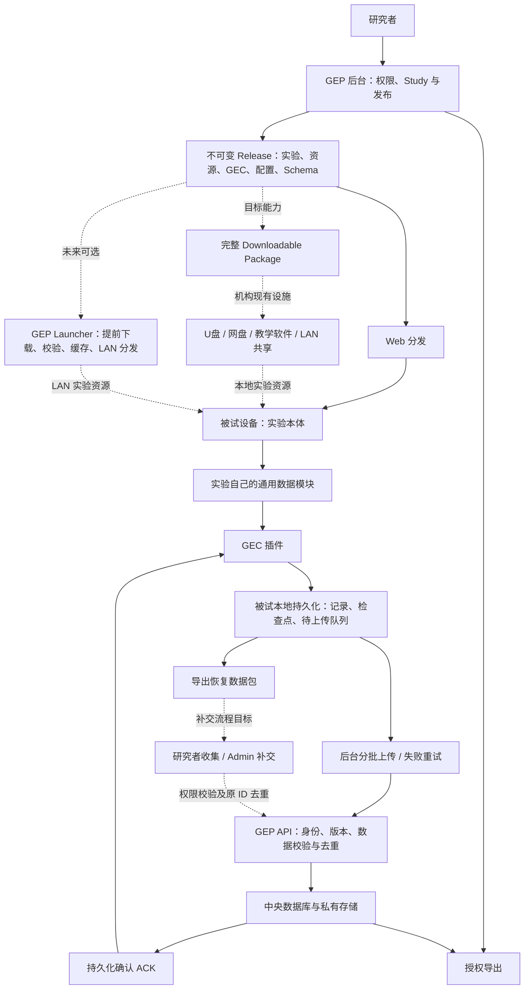
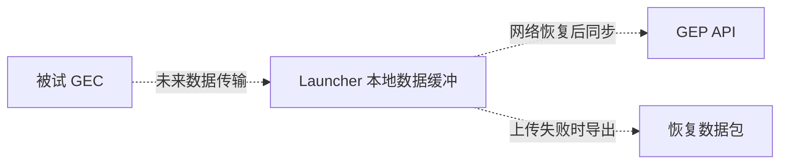

# GEP — GuguguLab Experiment Platform

GEP 提供研究者后台与数据服务，GEC 为实验提供本地优先的数据接入。当前已有可运行的**隔离合成工程版**，尚未完成 Phase 01–03 全部验收，不能用于真实研究收数。

同一个 Godot 合成任务通过自己的通用数据模块运行；本地后端、Web IndexedDB 后端和原生 SQLite 后端由入口选择。任务包含 RT／选择和不规则嵌套事件。后台提供三种准入、构建登记、Web 包上传／预览／批准、原生连接配置、状态、受控恢复、受保护固定快照与成员权限。

已实测 Godot 4.7.2、macOS 26.6.2 arm64、Chrome 152：Web 和独立原生程序的数据经本地事务、真实 HTTP API、数据库、ACK 和 JSONL 导出对账；覆盖断网、丢 ACK、进程终止、完整 trial 恢复及清理边界。实际支持范围和未执行项见[验收记录](public_docs/verification.md)。

## 启动

```sh
uv sync --frozen --python 3.12
pnpm install --frozen-lockfile
.venv/bin/python tools/dev_instance.py
.venv/bin/python tools/serve.py
```

打开 `http://admin.localhost:8000/login`。首次初始化生成本地随机合成凭据，再次启动不重建账号。[完整构建、配置、演示和验收步骤](public_docs/quickstart.md)。

## 当前边界

- 本机 Web 与 macOS 原生合成链路已运行；其他平台不承诺兼容。
- 完成任务、本地保存、服务器收齐和科学验收是不同事实。
- 只支持原设备／原存储的明确 trial 恢复；公开 ID 不能取回旧答案或接管会话。
- 最小 Compose 已在隔离 Linux arm64 环境通过真实上传、重启/替换持久化、Owner 与错卷验收。Windows 11 / Chrome 的实体 LAN 基础链路已验；Mac 原生窗口与实际按键已验，独立研究者操作仍待验。
- Runner、Future GEP Launcher（可选 LAN 分发工具）、自动分析、真实研究和生产部署未启用；部分完整故障矩阵仍未完成，详见验收记录。

## 开发状态与 Phase 01–03 待验项目

状态整理于 **2026-09-10**；依据最近 **2026-09-08** 的运行证据，本次没有重新运行功能测试。Phase 01–03 均在收尾，尚未全部通过。

| 阶段 | 已有工程证据 | 距离验收仍缺什么 |
|---|---|---|
| Phase 01：真实数据链路 | Godot Web → 本地事务 → API → 数据库 → ACK → 授权导出；32 项服务端测试通过 | T09 已于 2026-09-12 通过实际 Docker Compose 启动、重启/替换持久化、Owner 保留、重复初始化及错卷拒绝；阶段总验收待最终核对 |
| Phase 02：插件与可靠性 | macOS 原生事务/进程终止/丢 ACK；Windows 实体 LAN HTTPS、断网补传、重开恢复与双标签争用 | 原生 GUI 恢复输入已实测通过；补 **T10 小限额/背压**、适用的 **T11 状态与旧上传窗口**组合、T23 原生无策略数据恢复及 T24 五个清理中断点已通过；共享设备恢复权限剩余矩阵 |
| Phase 03：研究者图形首版 | 研究/名单/三种准入、构建登记、配置导出、Web 验证/预览/批准、状态/权限/导出 GUI 回归 | T14/T22 上传中断矩阵已通过：超限/截断、网络失败、文件替换前后强杀和幂等重试均保护旧 Release；**T17 非原开发者独立操作**完整工作流；Windows 新布局补验 |

**2026-09-12 更新：原生 GUI 恢复通过。**实测确认自动打字工具漏掉下划线，粘贴则完整传入许可。独立导出的程序经真实输入框、Start 和响应按键恢复到 Trial 2 并完成；原会话、原记录、新运行段/时钟、授权导出和本地清理均已对账。另已修复合法恢复后队列未解除暂停的问题；已结束待传队列也可经授权仅补传；重建后 2 项发行准备与 23 项贯通测试通过，服务端 36 项通过。继续补齐 Compose 与剩余故障矩阵，再安排独立研究者验收。

Web 输入框遮挡 Start 已修复，Godot 布局回归及 17 项发行/端到端测试通过，Web/macOS 已重新构建；**修复后布局尚待 Windows 实机确认**。Windows 会话 ID/许可各粘贴一次恢复 Trial 2、断网补传和逐记录对账已通过，不需要无故重测。

T17 需要非原开发者按指南独立完成登录、研究/名单、包验证与预览、批准招募、状态/恢复、导出及成员权限，记录需要帮助之处。自动 GUI 测试和逐步指导被试操作不能替代它。

表格列出尚未闭合的测试组，不是精确剩余用例数量。真实磁盘耗尽、物理断电等尚无证据，不作耐故障承诺；独立备份恢复 T12、正式研究治理、科学计时和 VPS 部署归后续 Phase 04，不混算为本轮已通过。完整证据与限制见[验收记录](public_docs/verification.md)。

接口：[GEP/1 协议](public_docs/protocol.md)。依赖：[第三方声明](public_docs/third_party.md)。

## 许可

GEP 与 GEC 的项目原创代码采用 [Apache License 2.0](LICENSE)。允许使用、修改、分发与商业使用，具体义务以许可证正文为准。

第三方依赖及材料保留各自的许可证，见[第三方声明](public_docs/third_party.md)。研究者上传的实验、量表、刺激材料及被试数据不因使用本软件而自动适用本许可证。

## 目标架构

**Experiment Delivery 与 Data Collection 解耦。**下图是目标设计，不代表所有节点已交付。虚线是后续规划；实线表示数据或资源流向，也不单独代表验收通过。



- **已有合成实现**：GEP 后台、Web/macOS GEC、本地保存、上传重试、ACK、恢复数据导出和授权取数；完整验收状态见上表。
- **完整下载包目标**：包含实验全部资源、GEC、冻结 Study/Release 公开配置、schema/protocol 与 manifest，本地运行，不跳回 study 网站重新加载实验。现有独立原生程序加配置导出不等于后台完整套件下载已交付。已发布完整 artifact（包括配置）不可修改，变更必须创建新 Release。
- **失败补交目标**：GEC 导出原 Study/Release/session/event 标识和记录，研究者通过 Admin 补交并去重；现有恢复导出不能当作完整 Admin 补交已验收。导出不删除未确认队列，也不等于 GEP 已收齐。
- **Future GEP Launcher**：optional local delivery utility，只做 download → verify → cache → serve。不是本地 GEP、GEC 的一部分或 v1 必需客户端。先验证机构现有分发设施是否足够，再决定是否开发；40–50 台是需求场景，不是当前容量保证。

未来 Launcher 可提供失败数据导出入口，但教师机分发缓存本身没有各被试数据；当前数据仍应从被试端 GEC 导出。若需要教师机统一收集并导出，须另行实现更后期的 **Offline Extension**：



该扩展尚未实现，不要求 GEC 依赖 Launcher，不替代被试端本地保存；也不承诺当前支持完全离线首次准入。本节目标不扩大当前 Phase 01–03 验收范围。
